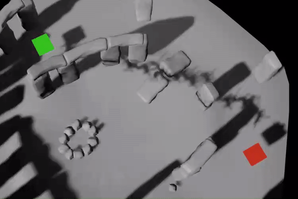
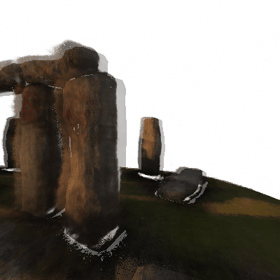
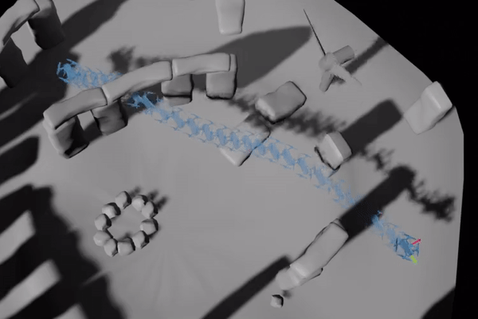

<!-- <iframe width="560" height="315" src="https://www.youtube.com/embed/5JjWpv9BaaE" title="YouTube video player" frameborder="0" allow="accelerometer; autoplay; clipboard-write; encrypted-media; gyroscope; picture-in-picture" allowfullscreen></iframe> -->

<!-- 
 -->

<iframe width="560" height="315" style="position: absolute; width: 100%; height: 100%; left: 0; top: 0;" src="https://www.youtube.com/embed/5JjWpv9BaaE" title="YouTube video player" frameborder="0" allow="accelerometer; autoplay; clipboard-write; encrypted-media; gyroscope; picture-in-picture" allowfullscreen></iframe>

<!-- 
 -->

	<h4> Abstract </h4>
	{{page.abstract}}

<a class="d-block d-md-none" data-toggle="collapse" data-target="#collapseExample" aria-expanded="false" aria-controls="collapseExample"><b>[<u>abstract</u>]</b></a>

  

    {{page.abstract}}
  

#### Trajectory Optimizer

  

    
  

We propose a trajectory optimizer which uses a NeRF representation of the environment to encode obstacle geometry. As shown above, we initialize our planner with an A* search, and then use gradient descent to refine the trajectory to one which is dynamically feasible and minimizes both collision and control effort.

#### State Estimator

  

    
  

We also propose a NeRF-based recursive state estimator, which uses the neural rendering process as a differentiable measurement model. Our method shows fast convergence to the true state (shown above, as the transparent "estimated" image, generated via neural rendering, converges to the opaque ground truth image), and is able to estimate the full robot state, including both 6D pose as well as linear and angular rates.

#### MPC Controller

  

    
  

We can combine the trajectory optimiser and state estimator into a controller capable of localising and dynamically re-optimising the trajectory to reject noise and disturbances.
